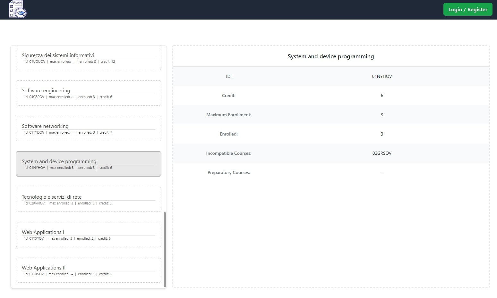
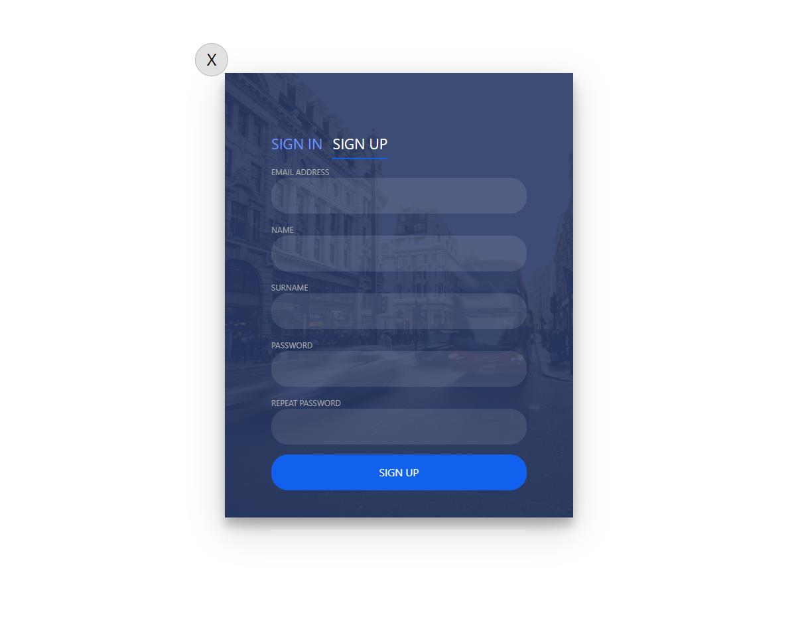
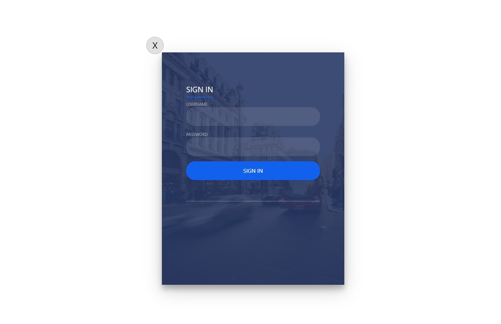
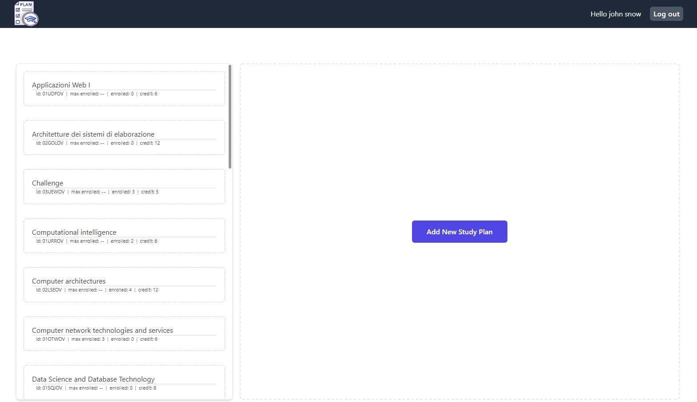
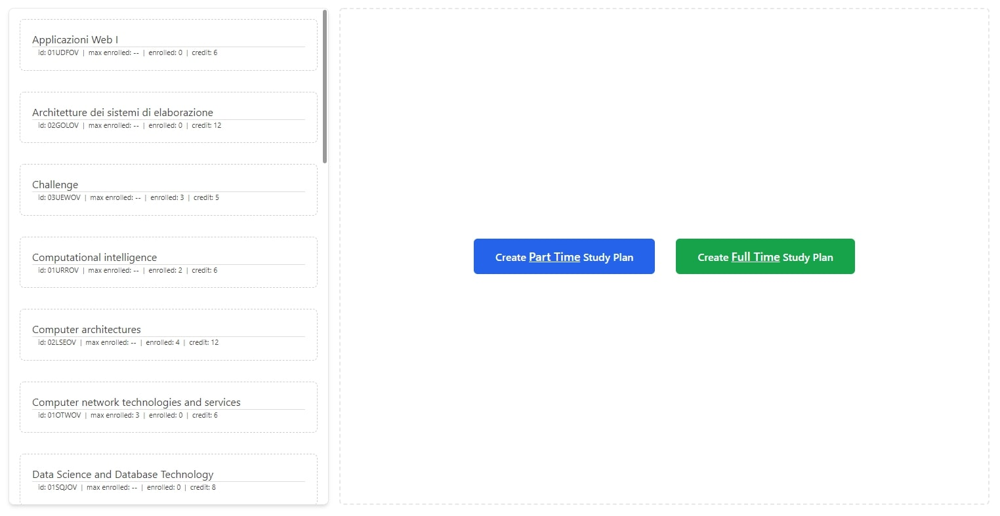
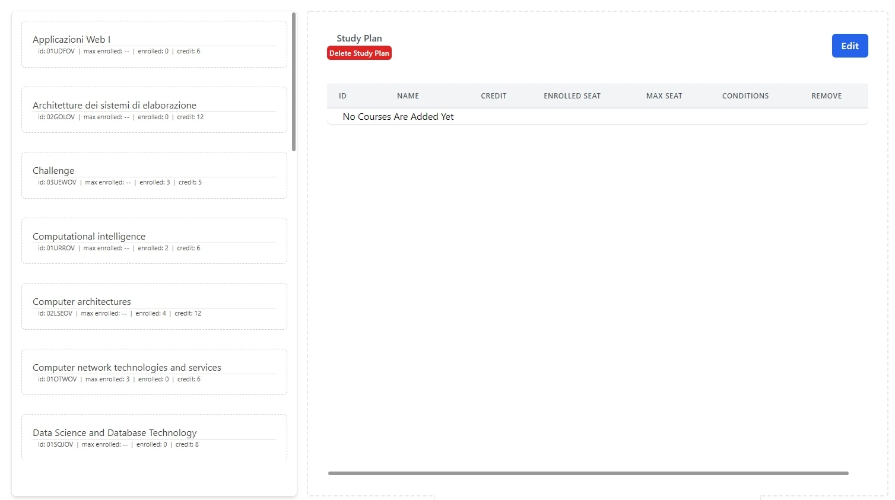
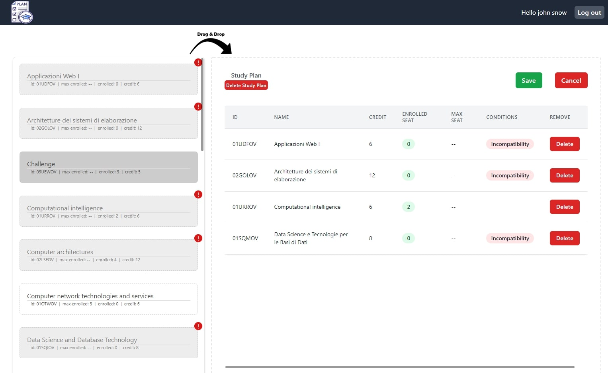

# Exam #1: "StudyPlan"

## React Client Application Routes

- Route `/`: The main page of the website which shows the list of all the courses and their information like course name and its code
- Route `/login`: The login form is shown here and the user can login to they user-panel through this page by entering their username and password
- Route `/user-panel`:  User will be able to create their study plan and drag and drop their desired courses into the created study plan 

## API Server

- POST `/api/login`
  - request body:
    `{"email":"user1@gmail.com","password":"************"}`
  - response body content:
    `{"id":1,"name":"john","surname":"snow","email":"user1@gmail.com"}`
- POST `/api/register`
  - request body:
    `{"email":"user10@gmail.com","password":"****","name":"John","surname":"Snow"}`
  - response body content:
    `{"result":true}`
- POST `/api/logout`
  - No request body or response body
- POST `/api/studyplan`
  - request body:
    `{"type":"partTime"}`
  - response body:
    `{"type":"Part time","maxCredits":40,"minCredits":20,"id":6}`
- GET `/api/studyplan`
  - response body:
    ```
    {
        "id": 8,
        "minCredits": 20,
        "maxCredits": 40,
        "type": "Part time",
        "userId": 1,
        "courses": [
            {
            "id": 1,
            "code": "02GOLOV",
            "name": "Architetture dei sistemi di elaborazione",
            "credit": 12,
            "incompatibleCoursesId": [
                "02LSEOV"
            ],
            "preparatoryCoursesId": [],
            "maxStudents": -1,
            "incompatibleCourses": [
                {
                "id": 2,
                "code": "02LSEOV",
                "name": "Computer architectures",
                "credit": 12,
                "incompatibleCoursesId": "02GOLOV",
                "preparatoryCoursesId": null,
                "maxStudents": -1
                }
            ],
            "preparatoryCourses": [],
            "enrolled": 1
            },
            {
            "id": 9,
            "code": "01UDUOV",
            "name": "Sicurezza dei sistemi informativi ",
            "credit": 12,
            "incompatibleCoursesId": [
                "01TYMOV"
            ],
            "preparatoryCoursesId": [],
            "maxStudents": -1,
            "incompatibleCourses": [
                {
                "id": 8,
                "code": "01TYMOV",
                "name": "Information systems security services",
                "credit": 12,
                "incompatibleCoursesId": "01UDUOV",
                "preparatoryCoursesId": null,
                "maxStudents": -1
                }
            ],
            "preparatoryCourses": [],
            "enrolled": 1
            }
        ]
    }
    ```
- DELETE `/api/studyplan`
  - response body:
  `{"lastID":34,"changes":1}`

- PUT `/api/studyplan/:planId/courses`
  - request parameter:
    `9` 
  - request body:
    `[12,1,19,20]`

- GET `/api/courses`
  - response body:
  ```
  [
    {
        "id": 1,
        "code": "02GOLOV",
        "name": "Architetture dei sistemi di elaborazione",
        "credit": 12,
        "incompatibleCoursesId": [
        "02LSEOV"
        ],
        "preparatoryCoursesId": [],
        "maxStudents": -1,
        "incompatibleCourses": [
        {
            "id": 2,
            "code": "02LSEOV",
            "name": "Computer architectures",
            "credit": 12,
            "incompatibleCoursesId": "02GOLOV",
            "preparatoryCoursesId": null,
            "maxStudents": -1
        }
        ],
        "preparatoryCourses": [],
        "enrolled": 1
    },
    {
        "id": 2,
        "code": "02LSEOV",
        "name": "Computer architectures",
        "credit": 12,
        "incompatibleCoursesId": [
        "02GOLOV"
        ],
        "preparatoryCoursesId": [],
        "maxStudents": -1,
        "incompatibleCourses": [
        {
            "id": 1,
            "code": "02GOLOV",
            "name": "Architetture dei sistemi di elaborazione",
            "credit": 12,
            "incompatibleCoursesId": "02LSEOV",
            "preparatoryCoursesId": null,
            "maxStudents": -1
        }
        ],
        "preparatoryCourses": [],
        "enrolled": 4
    }
    ...
  ]
## Database Tables

- Table `user` - contains: `id, name, surname, email, password, salt`
- Table `studyplan` - contains: `id, minCredit, maxCredit, type, userId`
- Table `course` - contains: `id, code, name, credit, incompatibleCoursesId, preparatoryCoursesId, maxStudents`
- Table `scr` - contains: `id, cId, spId`
- ...

## Main React Components

- `Accordion` (in `/components/accordion/accordion.component.js`): It shows the course info like a foldable accordion
- `AccordionList` (in `/components/accordionList/accordion.component.js`): Contains the list of accordions
- `BlankStudyPlan` (in `/components/blankStudyPlan/blankStudyPlan.component.js`): It is shown when the studyplan is not created yet, it contains two buttons for creating 'full-time' or 'part-time' studyplans
- `CourseDetails` (in `/components/corseDetails/corseDetails.component.js`): On the main page when the users are not logged in this component is shown which presents the information about the courses when they are selected
- `Loading` (in `/components/loading/loading.component.js`): This component is shown instead of the main components when the data isn't gotten from the server and they are not ready yet
- `Navbar` (in `/components/navbar/navbar.component.js`): This is the navbar of the site
- `StudyPlan` (in `/components/studyPlan/studyPlan.component.js`): When a user creates a studyplan these components is shown and the user can do actions like add, remove, modify ... through the interaction with this one, this component is consist of these other components: `StudyPlanHeader, StudyPlanTable, StudyPlanTableElement`


## Paged

- - `LoginPage` (in `/pages/login/login.page.js`): The login page
- - `MainPage` (in `/pages/mainPage/main.page.js`): The main page, it is shown when user isn't logged in yet
- - `UserPanelPage` (in `/pages/userPanel/userPanel.page.js`): The user panel page

## Screenshots

### Main page

### Login / Register page

### Login / Register page

### User-panel: When study plan isn't created

### User-panel: choose studyplan type

### User-panel: Fresh studyplan

### User-panel: With studyplan and courses


## Users Credentials

|Username| Password|
|--------|---------|
|user1@gmail.com| testpassword| 
|user2@gmail.com| testpassword|
|user3@gmail.com| testpassword|
|user4@gmail.com| testpassword|
|user5@gmail.com| testpassword|
